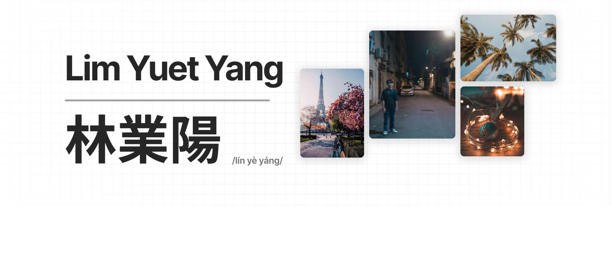

---

<h1 align="center">Hi there! I'm Yuet Yang 👋</h1>

  
Bachelor's Degree student in Data Science at TARUMT

  
Fullstack Developer | AI Engineer | Data Science Student

  

  
  

---

<h3 align="center">💻 Tech Stack</h3>

  
   
  
   
  

---

<h3 align="center">📊 GitHub Statitstics</h3>

  
  

---
